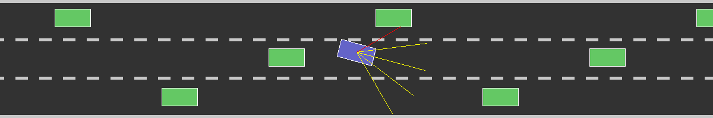

## Self-Driving Car Using Neural Networks and Genetic Algorithms

### What this is:
A Neural Network is used to "drive" a car as follows:
* The car has five sensors connected to the inputs of the neural 
network.
* Each sensor indicates how close an obstacle is in a certain 
direction.
* The outputs of the neural network determine the direction and 
speed of the car.
* The algorithm runs in several generations. In each generation, 
the best car from the previous generation is used, and a number 
of mutations of (the neural network of) that car are tried to 
select the best car for the next generation.
* The car must pass the traffic without collisions.

### How to Run:
* Clone this repository
* Run `python -r requirements.txt` to install the required 
libraries
* Run `python main.py`

### Libraries used:
* Pygame
* Pytest
### Concepts used:
* Neural Network
* Genetic Algorithm
### Acknowledgements:
The ideas in this project were inspired by the following course:
[Radu's JS Self-Driving Car Course](https://www.youtube.com/watch?v=Rs_rAxEsAvI)
### Conclusions:
The file `savedata/nn.pickle` contains a neural network that was trained 
on three regular traffic patterns: an upward cascade, a downward 
cascade and a 1-2 pattern. It can successfully negotiate these 
traffic patterns; in addition, it can also negotiate the two 
random traffic patterns, `savedata/random_traffic_1.pickle` and 
`savedata/random_traffic_2.pickle`.

### Contact: 
klarchaudhurir@gmail.com